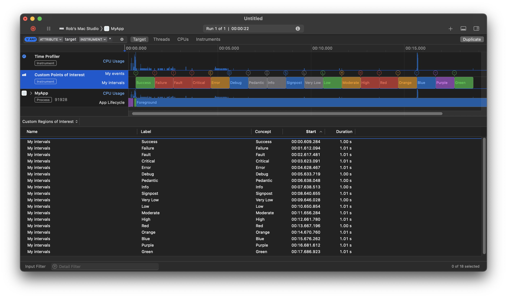

#  Custom Points of Interest

This provides a mechanism for multicolored intervals in Instruments.



## Usage

This project includes a [`CustomPointsOfInterest.swift`](Example/CustomPointsOfInterest.swift) helper that you can add to your Swift project. For simple events and intervals, it is merely:

```swift
let log = CustomPointsOfInterestLog(subsystem: "…")

log.event("Some string")

log.interval("Some string for interval") {
    // do something synchronous in here
}
```

Note, `interval` support closures that are synchronous, or those using `async`-`await`, too:

```swift
await log.interval("Some string for interval") {
    await doSomethingAsynchronous()
}
```

Or

```swift
try await log.interval("Some string for interval") {
    try await doSomethingAsynchronous()
}
```

But as shown in the screen snapshot, above, you can also optionally supply:

 * a name for the lane in Instruments; and/or
 * an “[Event Concept Engineering Type](https://help.apple.com/instruments/developer/mac/current/#/dev66257045)” which will dictate the color (and for signpost events, the icon, too).
 
E.g.:

```swift
log.event(lane: "Errors", "Some error message", concept: .error)

log.interval(lane: "Some custom string for lane", "Some string for interval", concept: .green) {
    // do something synchronous in here
}
```

To use this tool:

 * You can then profile the app <kbd>command</kbd>-<kbd>i</kbd> or “Product” » “Profile”. 
 * Choose whatever template you want. (“Time Profiler” is often a good starting point.)
 * Tap on the `+` button in the upper right corner and search/select for “Custom Points of Interest”. If the standard “Points of Interest” tool is already included in the template, feel free to remove it.
 * Start recording.

- - -

It is not terribly important, but I've added a separate [`OSLog` extension](Example/OSLog.swift) that provides a similar API (sans custom event concept engineering functionality) when using the standard “Points of Interest”. Obviously, for this, you do not have to install the “Custom Points of Interest” tool in Instruments at all, but rather just use the default one. But you can then do things like:

```swift
let poi = OSLog(subsystem: "…", category: .pointsOfInterest)

poi.event(lane: "My events", "Some label for event")
poi.interval(lane: "My intervals", "Some label for interval") {
    Thread.sleep(forTimeInterval: 1)
}
```

You obviously, using the standard “Points of Interest”, one loses all the coloring and special symbols that you get when using the event concept engineering types of the “Custom Points of Interest”, but it provides a simpler API than `os_signpost`.

## Installation

This Xcode project builds the Instruments “package”.

To install Intruments:

 * To install a custom instrument so that it can be re-used at will, one should open the this project and perform “Product” » “Archive”.
 
 * Choose on “Distribute Content”.
 
 * Choose “Built Products” and save it somewhere on your file system:
 
    

 * In macOS Finder, navigate into that resulting folder and find the `.instrdst` package. You can then double-click on that from the macOS Finder to install it in Instruments:
 
    

## Removal

* In Instruments, go to “Instruments” » “Settings...” » “Packages”.
* Tap “Uninstall” button.

## Implementation details

This uses the `os_signpost` API. The string generated by `os_signpost` must be in form of `Label:%d,Concept:%{public}@`, where “Label” is string that will control what text appears in the interval, and “Concept” is one of the strings listed in https://help.apple.com/instruments/developer/mac/current/#/dev66257045 that dictates the color of the interval. No spaces after the commas within this string.

The included [`CustomPointsOfInterest.swift`](Example/CustomPointsOfInterest.swift) helper abstracts you away from these implementation details. Just use the API as shown earlier in this document.

## License

13 March 2023

Copyright © 2022-2023 Robert M. Ryan. All Rights Reserved.

See [License](LICENSE.md).
